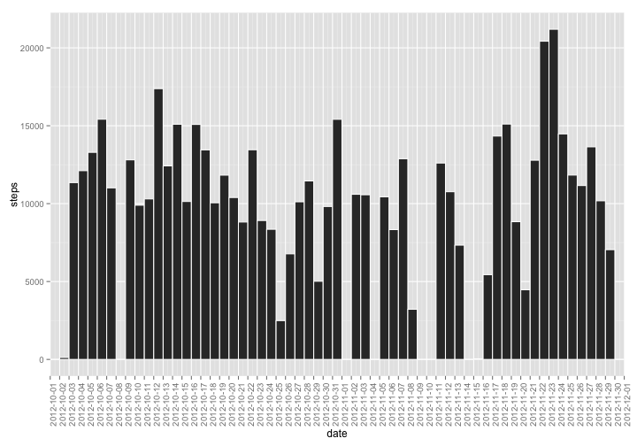
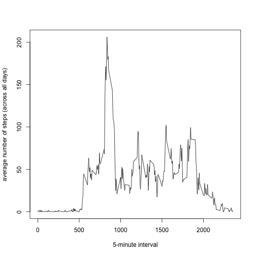
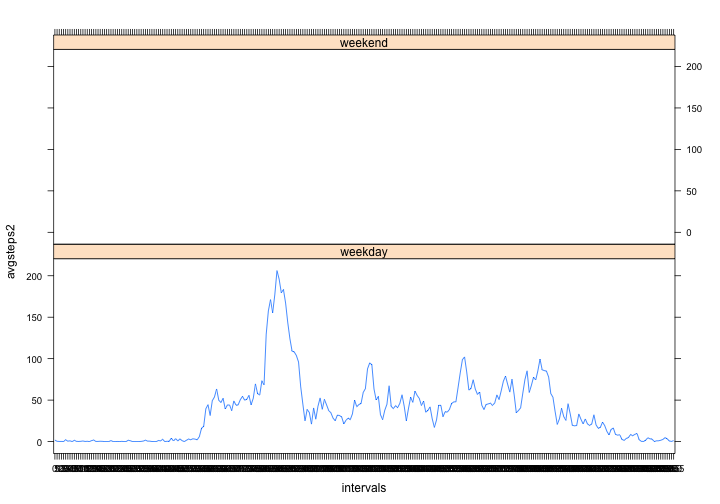

# Reproducible Research: Peer Assessment 1
This assignment makes use of data from a personal activity monitoring device. 
This device collects data at 5 minute intervals through out the day. The data consists of two months of data from an anonymous individual collected during 
the months of October and November, 2012 and include the number of steps taken 
in 5 minute intervals each day.


## Loading and preprocessing the data

The following code downloads the zip file into a temporary file, then extracts 
the text file and reads the data into a data frame called rawdata.

```r
url = "https://d396qusza40orc.cloudfront.net/repdata%2Fdata%2Factivity.zip"
temp <- tempfile()
download.file(url, destfile = temp, method = "curl")
rawdata <- read.csv(unz(temp, "activity.csv"))
unlink(temp)
```

The raw data, stored in the data frame `rawdata`, looks like this:

```
##   steps       date interval
## 1    NA 2012-10-01        0
## 2    NA 2012-10-01        5
## 3    NA 2012-10-01       10
## 4    NA 2012-10-01       15
## 5    NA 2012-10-01       20
## 6    NA 2012-10-01       25
```


For analysis, it will be more convenient to rearrange the data as a matrix of measurments (i.e. steps) by date (as columns) and by interval (as rows).
The data, in a format suitable for analysis, will be stored in the data frame "tidydata".

```r
tidysplit <- with(rawdata, split(steps, date))
tidy1 <- sapply(tidysplit, cbind)
tidydata <- as.data.frame(tidy1)
rownames(tidydata) <- levels(as.factor(rawdata$interval))
```

This is a sample of tidy data, stored in the data frame `tidydata`:

```
##    2012-11-10 2012-11-06 2012-10-24 2012-11-11 2012-10-11 2012-11-09
## 0          NA          0          0          0          0         NA
## 5          NA          0          0          0          0         NA
## 10         NA          0          0          0          0         NA
## 15         NA          0          0          0          8         NA
## 20         NA          0          0          0          0         NA
## 25         NA          0          0          0          0         NA
```


## What is mean total number of steps taken per day?

The following code creates a histogram of the total number of steps taken each
day. In the histogram, there is no bar for days in which there are no 
values recorded.  

**Note:** For convenience, the raw data is used, but with one transformation: the dates have been converted from a factor to a date.

```r
tidy2 <- transform(rawdata, date = as.Date(rawdata$date, format = "%Y-%m-%d"))
library(ggplot2)
ggplot(tidy2, aes(x = date)) + geom_histogram(binwidth = 1, aes(weight = steps), color = "white") + scale_x_date(breaks = "1 day", limits = c(as.Date(tidy2[which.min(tidy2[, 2]), 2]), as.Date(tidy2[which.max(tidy2[, 2]), 2]) + 1), expand = c(0 ,0)) + ylab("steps") + xlab("date") + theme(axis.text.x = element_text(angle = 90, hjust = 1, vjust = 1))
```

 

The following code creates a table displaying the **mean** and **median** total number of steps taken each day.  

**Note:** NA values have been excluded from the computation. Days in which there were no valid measurements (i.e. only NA values) are not displayed.

```r
mean1 <- as.data.frame(sapply(tidydata, mean, na.rm = TRUE))
names(mean1) <- "mean steps per day"
median1 <- as.data.frame(sapply(tidydata, median, na.rm = TRUE))
names(median1) <- "median steps per day"
mm <- cbind(mean1, median1)
library(xtable)
xtmean <- xtable(na.omit(mm), align = "lrr")
print(xtmean, type = "html")
```

<!-- html table generated in R 3.1.0 by xtable 1.7-3 package -->
<!-- Mon Jun 16 01:06:14 2014 -->
<TABLE border=1>
<TR> <TH>  </TH> <TH> mean steps per day </TH> <TH> median steps per day </TH>  </TR>
  <TR> <TD> 2012-10-02 </TD> <TD align="right"> 0.44 </TD> <TD align="right"> 0.00 </TD> </TR>
  <TR> <TD> 2012-10-03 </TD> <TD align="right"> 39.42 </TD> <TD align="right"> 0.00 </TD> </TR>
  <TR> <TD> 2012-10-04 </TD> <TD align="right"> 42.07 </TD> <TD align="right"> 0.00 </TD> </TR>
  <TR> <TD> 2012-10-05 </TD> <TD align="right"> 46.16 </TD> <TD align="right"> 0.00 </TD> </TR>
  <TR> <TD> 2012-10-06 </TD> <TD align="right"> 53.54 </TD> <TD align="right"> 0.00 </TD> </TR>
  <TR> <TD> 2012-10-07 </TD> <TD align="right"> 38.25 </TD> <TD align="right"> 0.00 </TD> </TR>
  <TR> <TD> 2012-10-09 </TD> <TD align="right"> 44.48 </TD> <TD align="right"> 0.00 </TD> </TR>
  <TR> <TD> 2012-10-10 </TD> <TD align="right"> 34.38 </TD> <TD align="right"> 0.00 </TD> </TR>
  <TR> <TD> 2012-10-11 </TD> <TD align="right"> 35.78 </TD> <TD align="right"> 0.00 </TD> </TR>
  <TR> <TD> 2012-10-12 </TD> <TD align="right"> 60.35 </TD> <TD align="right"> 0.00 </TD> </TR>
  <TR> <TD> 2012-10-13 </TD> <TD align="right"> 43.15 </TD> <TD align="right"> 0.00 </TD> </TR>
  <TR> <TD> 2012-10-14 </TD> <TD align="right"> 52.42 </TD> <TD align="right"> 0.00 </TD> </TR>
  <TR> <TD> 2012-10-15 </TD> <TD align="right"> 35.20 </TD> <TD align="right"> 0.00 </TD> </TR>
  <TR> <TD> 2012-10-16 </TD> <TD align="right"> 52.38 </TD> <TD align="right"> 0.00 </TD> </TR>
  <TR> <TD> 2012-10-17 </TD> <TD align="right"> 46.71 </TD> <TD align="right"> 0.00 </TD> </TR>
  <TR> <TD> 2012-10-18 </TD> <TD align="right"> 34.92 </TD> <TD align="right"> 0.00 </TD> </TR>
  <TR> <TD> 2012-10-19 </TD> <TD align="right"> 41.07 </TD> <TD align="right"> 0.00 </TD> </TR>
  <TR> <TD> 2012-10-20 </TD> <TD align="right"> 36.09 </TD> <TD align="right"> 0.00 </TD> </TR>
  <TR> <TD> 2012-10-21 </TD> <TD align="right"> 30.63 </TD> <TD align="right"> 0.00 </TD> </TR>
  <TR> <TD> 2012-10-22 </TD> <TD align="right"> 46.74 </TD> <TD align="right"> 0.00 </TD> </TR>
  <TR> <TD> 2012-10-23 </TD> <TD align="right"> 30.97 </TD> <TD align="right"> 0.00 </TD> </TR>
  <TR> <TD> 2012-10-24 </TD> <TD align="right"> 29.01 </TD> <TD align="right"> 0.00 </TD> </TR>
  <TR> <TD> 2012-10-25 </TD> <TD align="right"> 8.65 </TD> <TD align="right"> 0.00 </TD> </TR>
  <TR> <TD> 2012-10-26 </TD> <TD align="right"> 23.53 </TD> <TD align="right"> 0.00 </TD> </TR>
  <TR> <TD> 2012-10-27 </TD> <TD align="right"> 35.14 </TD> <TD align="right"> 0.00 </TD> </TR>
  <TR> <TD> 2012-10-28 </TD> <TD align="right"> 39.78 </TD> <TD align="right"> 0.00 </TD> </TR>
  <TR> <TD> 2012-10-29 </TD> <TD align="right"> 17.42 </TD> <TD align="right"> 0.00 </TD> </TR>
  <TR> <TD> 2012-10-30 </TD> <TD align="right"> 34.09 </TD> <TD align="right"> 0.00 </TD> </TR>
  <TR> <TD> 2012-10-31 </TD> <TD align="right"> 53.52 </TD> <TD align="right"> 0.00 </TD> </TR>
  <TR> <TD> 2012-11-02 </TD> <TD align="right"> 36.81 </TD> <TD align="right"> 0.00 </TD> </TR>
  <TR> <TD> 2012-11-03 </TD> <TD align="right"> 36.70 </TD> <TD align="right"> 0.00 </TD> </TR>
  <TR> <TD> 2012-11-05 </TD> <TD align="right"> 36.25 </TD> <TD align="right"> 0.00 </TD> </TR>
  <TR> <TD> 2012-11-06 </TD> <TD align="right"> 28.94 </TD> <TD align="right"> 0.00 </TD> </TR>
  <TR> <TD> 2012-11-07 </TD> <TD align="right"> 44.73 </TD> <TD align="right"> 0.00 </TD> </TR>
  <TR> <TD> 2012-11-08 </TD> <TD align="right"> 11.18 </TD> <TD align="right"> 0.00 </TD> </TR>
  <TR> <TD> 2012-11-11 </TD> <TD align="right"> 43.78 </TD> <TD align="right"> 0.00 </TD> </TR>
  <TR> <TD> 2012-11-12 </TD> <TD align="right"> 37.38 </TD> <TD align="right"> 0.00 </TD> </TR>
  <TR> <TD> 2012-11-13 </TD> <TD align="right"> 25.47 </TD> <TD align="right"> 0.00 </TD> </TR>
  <TR> <TD> 2012-11-15 </TD> <TD align="right"> 0.14 </TD> <TD align="right"> 0.00 </TD> </TR>
  <TR> <TD> 2012-11-16 </TD> <TD align="right"> 18.89 </TD> <TD align="right"> 0.00 </TD> </TR>
  <TR> <TD> 2012-11-17 </TD> <TD align="right"> 49.79 </TD> <TD align="right"> 0.00 </TD> </TR>
  <TR> <TD> 2012-11-18 </TD> <TD align="right"> 52.47 </TD> <TD align="right"> 0.00 </TD> </TR>
  <TR> <TD> 2012-11-19 </TD> <TD align="right"> 30.70 </TD> <TD align="right"> 0.00 </TD> </TR>
  <TR> <TD> 2012-11-20 </TD> <TD align="right"> 15.53 </TD> <TD align="right"> 0.00 </TD> </TR>
  <TR> <TD> 2012-11-21 </TD> <TD align="right"> 44.40 </TD> <TD align="right"> 0.00 </TD> </TR>
  <TR> <TD> 2012-11-22 </TD> <TD align="right"> 70.93 </TD> <TD align="right"> 0.00 </TD> </TR>
  <TR> <TD> 2012-11-23 </TD> <TD align="right"> 73.59 </TD> <TD align="right"> 0.00 </TD> </TR>
  <TR> <TD> 2012-11-24 </TD> <TD align="right"> 50.27 </TD> <TD align="right"> 0.00 </TD> </TR>
  <TR> <TD> 2012-11-25 </TD> <TD align="right"> 41.09 </TD> <TD align="right"> 0.00 </TD> </TR>
  <TR> <TD> 2012-11-26 </TD> <TD align="right"> 38.76 </TD> <TD align="right"> 0.00 </TD> </TR>
  <TR> <TD> 2012-11-27 </TD> <TD align="right"> 47.38 </TD> <TD align="right"> 0.00 </TD> </TR>
  <TR> <TD> 2012-11-28 </TD> <TD align="right"> 35.36 </TD> <TD align="right"> 0.00 </TD> </TR>
  <TR> <TD> 2012-11-29 </TD> <TD align="right"> 24.47 </TD> <TD align="right"> 0.00 </TD> </TR>
   </TABLE>


## What is the average daily activity pattern?

The following code generates a time series plot of the 5-minute interval (x-axis) and the average number of steps taken, averaged across all days (y-axis).  

```r
intnames <- rownames(tidydata)
avgsteps <- tapply(rawdata$steps, rawdata$interval, mean, na.rm = TRUE)
plot(intnames, avgsteps, type = "l", xlab = "5-minute interval", ylab = "average number of steps (across all days)")
```

 

The following code identifies the name of the 5-minute interval containing the maximum average number of steps, calculated across all the days in the dataset.

```r
names(which.max(avgsteps))
```

```
## [1] "835"
```


## Imputing missing values

The following code calculates the total number of missing values in the dataset.  

```r
stepsNA <- is.na(tidydata)
sum(stepsNA)
```

```
## [1] 2304
```

The following code creates a new version of tidy data (`tidydata2`) where NA values have been replaced with the corresponding mean number of steps for the 5-minute interval, averaged across all days.

```r
tidydata2 <- tidydata
avgstepsinterval <- as.vector(avgsteps)

for(r in 1:nrow(tidydata2)) {
    for(c in 1:ncol(tidydata2)) {
        if(is.na(tidydata2[r, c])==TRUE) {
            tidydata2[r, c] <- avgstepsinterval[r]
        }
        else { next(c) }
    }
}
```

This is a sample showing imputed values in `tidydata2`:

```
##    2012-11-01 2012-10-28 2012-11-26 2012-10-05 2012-11-15 2012-11-25
## 0     1.71698          0          0          0          0          0
## 5     0.33962          0          0          0          0          0
## 10    0.13208          0          0          0          0          0
## 15    0.15094          0          0          0          0          0
## 20    0.07547          0          0          0          0          0
## 25    2.09434          0          0          0          0          0
##    2012-11-08 2012-10-08 2012-10-24 2012-11-03 2012-10-01 2012-11-13
## 0           0    1.71698          0          0    1.71698          0
## 5           0    0.33962          0          0    0.33962          0
## 10          0    0.13208          0          0    0.13208          0
## 15          0    0.15094          0          0    0.15094          0
## 20          0    0.07547          0          0    0.07547          0
## 25          0    2.09434          0          0    2.09434          0
```


## Are there differences in activity patterns between weekdays and weekends?

The following code creates a new factor variable in the `tidy2` dataset with two levels -- "weekday" and "weekend" indicating whether a given date is a weekday or weekend day.

```r
tidy2$weekday <- weekdays(tidy2$date)
for(r in 1:nrow(tidy2)) {
    if(tidy2[r, 4]=="Saturday" | tidy2[r, 4]=="Sunday") { tidy2[r, 4] <- "weekend" }
    else { tidy2[r, 4] <- "weekday" }
}
tidy2 <- transform(tidy2, weekday = factor(weekday))
levels(tidy2$weekday)
```

```
## [1] "weekday" "weekend"
```


The following code creates a panel plot containing a time series plot (i.e. type = "l") of the 5-minute interval (x-axis) and the average number of steps taken, averaged across all weekday days or weekend days (y-axis).

```r
head(tidy2[tidy2$weekday=="weekend"])
```

```
## Error: undefined columns selected
```

```r
intervals <- as.factor(tidy2$interval)
avgsteps2 <- tapply(tidy2$steps, tidy2$interval, mean, na.rm = TRUE)
library(lattice)
xyplot(avgsteps2 ~ intervals | weekday, data = tidy2, layout = c(1, 2), type = "l")
```

 
